# 🏗️ SƠ ĐỒ CHI TIẾT HỆ THỐNG CRM IQI

> **Phiên bản:** 2.0 — Cập nhật: 10/04/2026  
> Mở trên GitHub hoặc VS Code (Ctrl+Shift+V) để xem Mermaid dạng hình.

---

## 📑 Mục lục

1. [Kiến trúc tổng quan toàn hệ thống](#1-kiến-trúc-tổng-quan-toàn-hệ-thống)
2. [Luồng dữ liệu chính (Data Flow)](#2-luồng-dữ-liệu-chính)
3. [Đồng bộ Google Sheet chi tiết](#3-đồng-bộ-google-sheet-chi-tiết)
4. [Vòng đời Lead hoàn chỉnh](#4-vòng-đời-lead-hoàn-chỉnh)
5. [Hệ thống trạng thái Lead (21 status)](#5-hệ-thống-trạng-thái-lead)
6. [Auto-Rotate & Lịch chia tự động](#6-auto-rotate--lịch-chia-tự-động)
7. [Telegram Bot Flow](#7-telegram-bot-flow)
8. [Facebook Integration](#8-facebook-integration)
9. [AI & Machine Learning](#9-ai--machine-learning)
10. [Hệ thống phân quyền 3 cấp](#10-hệ-thống-phân-quyền-3-cấp)
11. [Database Schema](#11-database-schema)
12. [Background Jobs & Scheduled Tasks](#12-background-jobs--scheduled-tasks)
13. [Real-time & Socket.IO](#13-real-time--socketio)
14. [Frontend Pages & Components](#14-frontend-pages--components)
15. [Backup, Restore & An toàn dữ liệu](#15-backup-restore--an-toàn-dữ-liệu)
16. [API Endpoints Map](#16-api-endpoints-map)

---

## 1. Kiến trúc tổng quan toàn hệ thống

```mermaid
flowchart TB
    classDef external fill:#FFF3E0,stroke:#E65100,color:#000
    classDef server fill:#E8F5E9,stroke:#2E7D32,color:#000
    classDef db fill:#E3F2FD,stroke:#1565C0,color:#000
    classDef frontend fill:#F3E5F5,stroke:#6A1B9A,color:#000
    classDef infra fill:#ECEFF1,stroke:#37474F,color:#000

    subgraph INTERNET["🌐 NGUỒN BÊN NGOÀI"]
        direction LR
        GS["📊 Google Sheets\n─────────────\n• Dữ liệu lead từ QC\n• Sheet bài đăng MKT\n• Sheet chi phí QC"]:::external
        TG["📱 Telegram Bot\n─────────────\n• Bot CRM (id=2)\n• Webhook callback\n• Inline keyboard"]:::external
        FB["📘 Facebook Platform\n─────────────\n• Graph API v21.0\n• Ads API\n• Messenger API\n• CAPI (Conversions)"]:::external
        AI_EXT["🤖 AI Services\n─────────────\n• OpenAI GPT-4o\n• Perplexity sonar-pro\n• Google Gemini"]:::external
        NEWS_SRC["📰 Nguồn tin BĐS\n─────────────\n• Batdongsan.com.vn\n• Cho Tot\n• Tin tức thị trường"]:::external
    end

    subgraph VPS["🖥️ VPS 103.200.20.113"]
        direction TB

        subgraph NGINX["Nginx Reverse Proxy"]
            SSL["HTTPS crm-iqi.id.vn\n→ localhost:4000"]:::infra
        end

        subgraph NODE["⚙️ Node.js Server (Express 5.1 · Port 4000)"]
            direction TB

            subgraph AUTH_LAYER["🔐 Authentication Layer"]
                JWT["JWT Token\nverifyToken middleware"]
                ROLES["Role Check\nadmin · manager · sale"]
                RATE["Rate Limiter\nexpress-rate-limit"]
            end

            subgraph CORE["📋 Core Business Logic"]
                SYNC["🔄 Sync Engine\nsyncAllProjects()"]
                LEAD_OPS["📝 Lead Operations\nchia · xáo · feedback · recall"]
                ROTATE["🔁 Auto-Rotate\nautoRotateLeads()"]
                SCHEDULE["📅 Lịch chia\nautoSchedule()"]
                POST_FIX["🔧 Post-sync Fix\npostSyncStatusFix()"]
            end

            subgraph INTEGRATIONS["🔌 Integrations"]
                TG_HANDLER["Telegram Handler\nwebhook · notify · callback"]
                FB_HANDLER["Facebook Handler\nads · messenger · pages · CAPI"]
                AI_HANDLER["AI Handler\ncontent review · advisor · news"]
                SHEET_POST["Sheet Posts\nbài đăng · lịch đăng"]
            end

            subgraph DATA_LAYER["📊 Data Layer"]
                READ_DATA["readData()\nĐọc leads + history + campaigns"]
                FILTER["filterDataForRole()\nLọc theo vai trò"]
                ANALYTICS["Analytics Engine\nthống kê · báo cáo · CPL"]
            end

            SOCKET_IO["🔌 Socket.IO Server\nReal-time push"]
            BACKUP_SYS["💾 Backup System\nauto 8h · manual · selective"]
        end

        subgraph DATABASE["🗄️ SQLite Database"]
            direction LR
            DB_MAIN["crm.db\n─────────\n20+ tables\n~500MB"]:::db
            DB_BACKUP["backup/\n─────────\ncrm_*.db\nGiữ 7 ngày"]:::db
        end
    end

    subgraph CLIENTS["🖥️ Frontend (React 19 + Vite)"]
        direction LR
        ADMIN_UI["👑 Admin View\n12 tabs đầy đủ"]:::frontend
        MGR_UI["👔 Manager View\nDự án được gán"]:::frontend
        SALE_UI["👤 Sale View\nLead của mình"]:::frontend
    end

    %% External connections
    GS -->|"API v4\n3 phút/lần"| SYNC
    TG -->|"Webhook HTTPS"| TG_HANDLER
    FB -->|"Graph API\nOAuth Token"| FB_HANDLER
    AI_EXT -->|"REST API"| AI_HANDLER
    NEWS_SRC -->|"Scraping"| AI_HANDLER

    %% Server to DB
    CORE --> DB_MAIN
    DATA_LAYER --> DB_MAIN
    BACKUP_SYS --> DB_BACKUP

    %% Auth flow
    SSL --> AUTH_LAYER
    AUTH_LAYER --> CORE
    AUTH_LAYER --> DATA_LAYER
    AUTH_LAYER --> INTEGRATIONS

    %% Real-time
    SOCKET_IO -->|"WebSocket"| CLIENTS

    %% Data flow to frontend
    FILTER --> SOCKET_IO
```

---

## 2. Luồng dữ liệu chính

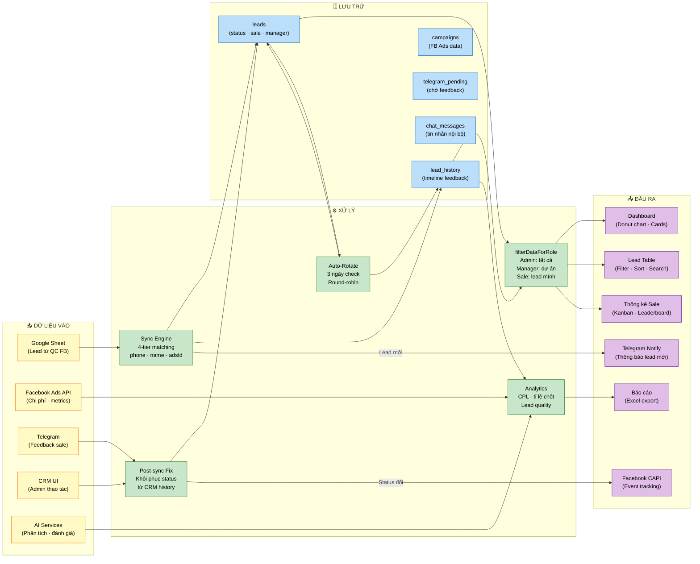

---

## 3. Đồng bộ Google Sheet chi tiết

```mermaid
flowchart TD
    classDef trigger fill:#FFECB3,stroke:#FF8F00,color:#000
    classDef action fill:#C8E6C9,stroke:#2E7D32,color:#000
    classDef decision fill:#FFF9C4,stroke:#F57F17,color:#000
    classDef data fill:#BBDEFB,stroke:#1565C0,color:#000
    classDef error fill:#FFCDD2,stroke:#C62828,color:#000

    START["⏰ Trigger\n─────────\n• Auto: mỗi 3 phút\n• Manual: Admin bấm Sync"]:::trigger

    subgraph PHASE1["📥 PHASE 1: Đọc dữ liệu từ Sheet"]
        READ["Đọc Google Sheet API v4\n(spreadsheets.values.get)\nLấy tất cả rows của sheet"]:::action
        PARSE["Parse dữ liệu\n─────────\n• Detect cột: Tên, SĐT, Trạng thái...\n• Detect Sale blocks\n  (Nhận Lead → Feedback)\n• extractSaleHistory()"]:::action
    end

    subgraph PHASE2["💾 PHASE 2: Backup & Matching"]
        BACKUP_HIST["Backup CRM history\n─────────\nSELECT * FROM lead_history\nWHERE source != 'sheet'\n  → crmHistMap (theo phone)"]:::data

        subgraph MATCHING["🔍 4-Tier Matching (Tìm lead cũ)"]
            TIER1["Tier 1: ads_id\n(Facebook Ads ID)\nChính xác nhất"]:::decision
            TIER2["Tier 2: phone + name\n(Chuẩn hóa +84)"]:::decision
            TIER3["Tier 3: phone only\n(Bỏ qua tên)"]:::decision
            TIER4["Tier 4: name only\n(Cùng dự án · fallback)"]:::decision
        end

        RESTORE_DATA["Khôi phục từ lead cũ\n─────────\n• sale_id, sale_name\n• manager_name\n• notes, is_hot\n• CRM history entries"]:::action
    end

    subgraph PHASE3["🔄 PHASE 3: Replace Data"]
        DELETE["DELETE FROM leads\nWHERE project_id = ?\n\nDELETE FROM lead_history\nWHERE lead_id IN (deleted)"]:::action
        INSERT_LEADS["INSERT leads\n─────────\n• Sheet data + khôi phục\n• Status: từ DATE-FIX hoặc sheet"]:::action
        INSERT_HIST["INSERT lead_history\n─────────\n1. Sheet history (seq thấp)\n2. CRM history (seq cao)\n→ CRM luôn ưu tiên hơn"]:::action
    end

    subgraph PHASE4["🔧 PHASE 4: Post-sync Status Fix"]
        LOAD_HIST["Load TẤT CẢ history\ncủa dự án vừa sync"]:::data
        SORT_DATE["Sort theo ngày giảm dần\n(parseContactDate)\nMới nhất → Cũ nhất"]:::action

        subgraph WALK["Duyệt history mỗi lead"]
            CHECK_SOURCE{"source = 'sheet'?"}
            CHECK_CHIA{"action = 'Chia lead'?"}
            CHECK_STATUS{"Có status?"}
            APPLY_FIX["UPDATE leads\nSET status = ?\nWHERE id = ?"]:::action
            SKIP["Bỏ qua\n(continue)"]
            BOUNDARY["Dừng duyệt\n(break tại Chia lead\ntừ nguồn CRM)"]
        end
    end

    subgraph PHASE5["📢 PHASE 5: Thông báo"]
        DETECT_NEW["Detect lead MỚI\n(Không match bất kỳ tier)"]:::action
        NOTIFY_TG["Gửi Telegram\n─────────\n• Tên · SĐT · Dự án\n• Nút: Quan tâm · Hẹn xem\n  KBM · Spam · Không nghe máy"]:::action
        EMIT_SOCKET["Socket.IO emit\n'data-changed'"]:::action
    end

    START --> READ
    READ --> PARSE
    PARSE --> BACKUP_HIST
    BACKUP_HIST --> TIER1
    TIER1 -->|"Match"| RESTORE_DATA
    TIER1 -->|"No match"| TIER2
    TIER2 -->|"Match"| RESTORE_DATA
    TIER2 -->|"No match"| TIER3
    TIER3 -->|"Match"| RESTORE_DATA
    TIER3 -->|"No match"| TIER4
    TIER4 -->|"Match"| RESTORE_DATA
    TIER4 -->|"No match"| RESTORE_DATA

    RESTORE_DATA --> DELETE
    DELETE --> INSERT_LEADS
    INSERT_LEADS --> INSERT_HIST
    INSERT_HIST --> LOAD_HIST
    LOAD_HIST --> SORT_DATE

    SORT_DATE --> CHECK_SOURCE
    CHECK_SOURCE -->|"Có → bỏ"| SKIP
    CHECK_SOURCE -->|"Không"| CHECK_CHIA
    CHECK_CHIA -->|"Có (CRM)"| BOUNDARY
    CHECK_CHIA -->|"Không"| CHECK_STATUS
    CHECK_STATUS -->|"Có"| APPLY_FIX
    CHECK_STATUS -->|"Không"| SKIP
    SKIP --> SORT_DATE

    APPLY_FIX --> DETECT_NEW
    BOUNDARY --> DETECT_NEW
    DETECT_NEW --> NOTIFY_TG
    NOTIFY_TG --> EMIT_SOCKET
```

---

## 4. Vòng đời Lead hoàn chỉnh

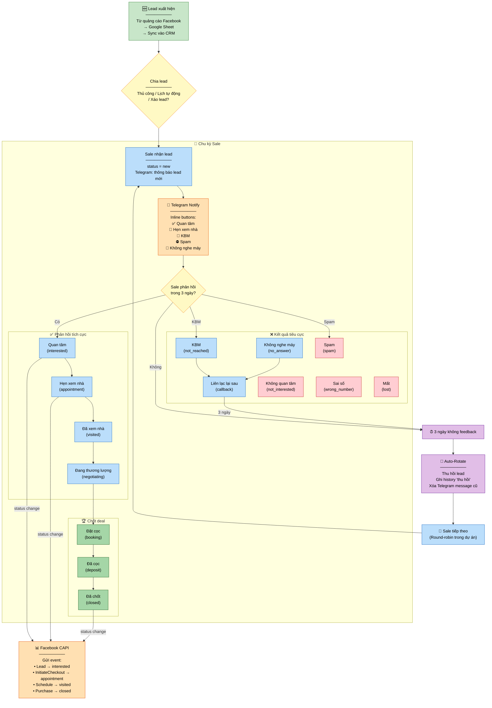

---

## 5. Hệ thống trạng thái Lead

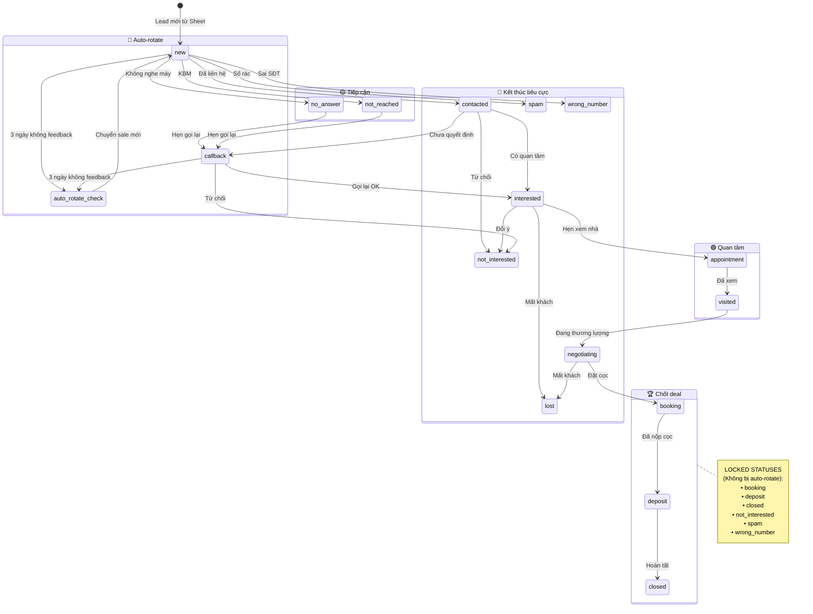

### Bảng 21 trạng thái

| # | Key | Tiếng Việt | Màu | Nhóm | Bị auto-rotate? |
|---|-----|-----------|------|------|:---:|
| 1 | `new` | Mới | 🔵 Blue | Tiếp cận | ✅ |
| 2 | `contacted` | Đã liên hệ | 🟣 Purple | Tiếp cận | ✅ |
| 3 | `interested` | Quan tâm | 🟢 Green | Quan tâm | ✅ |
| 4 | `appointment` | Hẹn xem nhà | 🟡 Amber | Quan tâm | ✅ |
| 5 | `visited` | Đã xem nhà | 🔵 Teal | Quan tâm | ✅ |
| 6 | `negotiating` | Đang thương lượng | 🟠 Orange | Chốt | ✅ |
| 7 | `callback` | Liên lạc lại sau | 🟡 Yellow | Chờ | ✅ |
| 8 | `no_answer` | Không nghe máy | 🔘 Gray | Tiếp cận | ✅ |
| 9 | `not_reached` | KBM | 🔘 Gray | Tiếp cận | ✅ |
| 10 | `booking` | Đặt cọc | 🟢 Light Green | Chốt | ❌ Locked |
| 11 | `deposit` | Đã cọc | 🟢 Green | Chốt | ❌ Locked |
| 12 | `closed` | Đã chốt | 🟢 Dark Green | Chốt | ❌ Locked |
| 13 | `not_interested` | Không quan tâm | 🔴 Red | Kết thúc | ❌ Locked |
| 14 | `wrong_number` | Sai số | 🔴 Red | Kết thúc | ❌ Locked |
| 15 | `spam` | Spam | ⚫ Dark | Kết thúc | ❌ Locked |
| 16 | `lost` | Mất | 🔴 Dark Red | Kết thúc | ❌ Locked |
| 17 | `canceled` | Đã huỷ cọc | 🟠 Orange | Kết thúc | ❌ Locked |
| 18 | `duplicate` | Trùng | 🔘 Gray | Kết thúc | ❌ Locked |
| 19 | `transferred` | Đã chuyển | 🔵 Blue | Kết thúc | ❌ Locked |
| 20 | `other` | Khác | 🔘 Gray | Khác | ✅ |
| 21 | `pending_review` | Chờ duyệt | 🟡 Yellow | Chờ | ✅ |

### Nhiệt độ Lead (Temperature)

| Badge | Điều kiện | Ý nghĩa |
|-------|----------|---------|
| 🔥 **Cực nóng** | Tạo ≤ 24h | Lead rất mới, cần gọi ngay |
| 🟠 **Nóng** | Tạo ≤ 72h | Lead mới, ưu tiên cao |
| 🟡 **Ấm** | Tạo ≤ 7 ngày | Lead còn tiềm năng |
| 🔵 **Lạnh** | Tạo > 7 ngày | Lead cũ, khả năng thấp |

---

## 6. Auto-Rotate & Lịch chia tự động

### 6.1 Auto-Rotate Flow

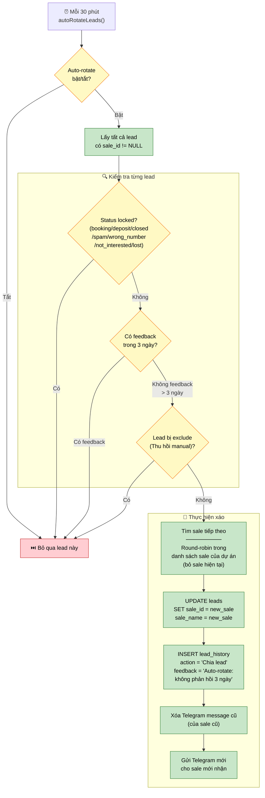

### 6.2 Lịch chia tự động (Auto-Schedule)

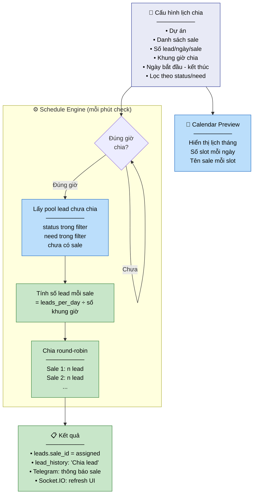

---

## 7. Telegram Bot Flow

```mermaid
flowchart TD
    classDef bot fill:#E3F2FD,stroke:#0D47A1,color:#000
    classDef user fill:#FFF3E0,stroke:#E65100,color:#000
    classDef server fill:#C8E6C9,stroke:#2E7D32,color:#000
    classDef db fill:#F3E5F5,stroke:#6A1B9A,color:#000

    subgraph OUTGOING["📤 Server → Telegram (Thông báo)"]
        NEW_LEAD["Lead mới sync\nhoặc chia cho sale"]:::server
        FIND_TG["Tìm Telegram chat_id\ntừ user.telegram_id"]:::server
        BUILD_MSG["Tạo message\n─────────\n📋 <b>Lead mới</b>\nTên: xxx\nSĐT: xxx\nDự án: xxx\nChiến dịch: xxx\nNhu cầu: xxx\nNhiệt độ: 🔥 Nóng"]:::bot
        BUTTONS["Inline Keyboard\n─────────\n✅ Quan tâm\n📅 Hẹn xem nhà\n🚫 KBM\n⛔ Spam\n📵 Không nghe máy"]:::bot
        SEND["sendMessage()\nvia Bot CRM API"]:::bot
        SAVE_PENDING["INSERT telegram_pending\n(telegram_id, lead_id,\nmessage_id, phone)"]:::db
    end

    subgraph INCOMING["📥 Telegram → Server (Callback)"]
        SALE_CLICK["Sale bấm nút\ntrên Telegram"]:::user
        WEBHOOK["POST /api/telegram-webhook/2\nCallback query"]:::server

        subgraph LOOKUP["🔍 Tìm lead"]
            BY_ID{"Tìm bằng\nlead_id?"}
            BY_PHONE{"Fallback:\ntìm bằng phone?"}
            FOUND["Lead found ✅"]:::server
            NOT_FOUND["Lead not found ❌\n(Answer: 'Lead không tồn tại')"]
        end

        UPDATE_STATUS["UPDATE leads\nSET status = selected"]:::server
        INSERT_HISTORY["INSERT lead_history\naction = 'Cập nhật'\nsource = 'telegram'"]:::server
        EDIT_MSG["editMessageReplyMarkup()\nXóa buttons cũ"]:::bot
        CONFIRM["answerCallbackQuery()\n'✅ Đã cập nhật: Quan tâm'"]:::bot
        DELETE_PENDING["DELETE FROM telegram_pending"]:::db
        CAPI_SEND["Gửi Facebook CAPI\nevent (nếu applicable)"]:::server
    end

    subgraph RECALL["🔙 Thu hồi Lead"]
        ADMIN_RECALL["Admin thu hồi lead\n(Xóa entry từ history)"]:::server
        FIND_MSG["Tìm message_id\ntừ telegram_pending"]:::db
        DELETE_MSG["deleteMessage()\nXóa từ Telegram chat"]:::bot
    end

    %% Outgoing flow
    NEW_LEAD --> FIND_TG
    FIND_TG --> BUILD_MSG
    BUILD_MSG --> BUTTONS
    BUTTONS --> SEND
    SEND --> SAVE_PENDING

    %% Incoming flow
    SALE_CLICK --> WEBHOOK
    WEBHOOK --> BY_ID
    BY_ID -->|"Có"| FOUND
    BY_ID -->|"Không\n(ID cũ sau sync)"| BY_PHONE
    BY_PHONE -->|"Có"| FOUND
    BY_PHONE -->|"Không"| NOT_FOUND
    FOUND --> UPDATE_STATUS
    UPDATE_STATUS --> INSERT_HISTORY
    INSERT_HISTORY --> EDIT_MSG
    EDIT_MSG --> CONFIRM
    CONFIRM --> DELETE_PENDING
    UPDATE_STATUS --> CAPI_SEND

    %% Recall flow
    ADMIN_RECALL --> FIND_MSG
    FIND_MSG --> DELETE_MSG
```

---

## 8. Facebook Integration

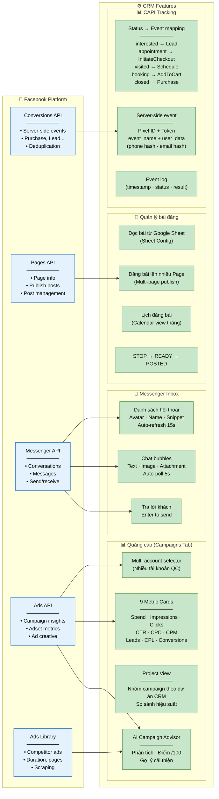

---

## 9. AI & Machine Learning

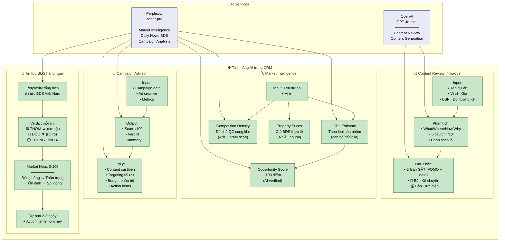

---

## 10. Hệ thống phân quyền 3 cấp

```mermaid
flowchart TD
    classDef admin fill:#FFCDD2,stroke:#C62828,color:#000
    classDef manager fill:#FFE0B2,stroke:#E65100,color:#000
    classDef sale fill:#C8E6C9,stroke:#2E7D32,color:#000
    classDef shared fill:#E3F2FD,stroke:#1565C0,color:#000

    subgraph ADMIN_ROLE["👑 ADMIN — Toàn quyền"]
        direction TB
        A_LEAD["📋 Lead Management\n─────────\n• Xem TẤT CẢ lead\n• Chia / Xáo lead\n• Thu hồi lead\n• Hot lead marking\n• Gán Manager\n• Cross-reference"]:::admin
        A_USER["👥 User Management\n─────────\n• CRUD tài khoản\n• Auto-create từ Sheet\n• Bulk create\n• Gán dự án\n• Force password change"]:::admin
        A_SYSTEM["⚙️ System\n─────────\n• Backup / Restore\n• Auto-rotate ON/OFF\n• Lịch chia tự động\n• Bot Telegram setup\n• Sheet config\n• CAPI config"]:::admin
        A_ANALYTICS["📊 Analytics\n─────────\n• Lead Quality Report\n• Sales Analytics\n• Facebook Ads insights\n• Market Intelligence\n• Campaign Advisor\n• Content Review AI"]:::admin
        A_SOCIAL["📱 Social\n─────────\n• FB Messenger inbox\n• Quản lý bài đăng\n• FB Pages setup\n• Thông báo hệ thống\n• Daily News config"]:::admin
    end

    subgraph MANAGER_ROLE["👔 MANAGER — Quản lý dự án"]
        direction TB
        M_LEAD["📋 Lead (Scoped)\n─────────\n• Xem lead DỰ ÁN ĐƯỢC GÁN\n• Cập nhật feedback\n• Chia lead dự án mình\n• Ghi chú lead"]:::manager
        M_USER["👥 User (Limited)\n─────────\n• Xem danh sách sale\n• Gán sale vào dự án"]:::manager
        M_ANALYTICS["📊 Analytics\n─────────\n• Thống kê dự án mình\n• Leaderboard sale"]:::manager
    end

    subgraph SALE_ROLE["👤 SALE — Lead của mình"]
        direction TB
        S_LEAD["📋 Lead (Own only)\n─────────\n• Xem lead ĐƯỢC GIAO\n• Cập nhật feedback\n• Status hiện PER-SALE\n  (không thấy sale khác)"]:::sale
        S_HIDDEN["🚫 Không thấy\n─────────\n• Số lần đăng ký\n• Lịch sử sale khác\n• Chia / Xáo lead\n• User management\n• System settings"]:::sale
    end

    subgraph SHARED_FEATURES["🔗 Chung cho tất cả"]
        CHAT_ALL["💬 Chat nội bộ"]:::shared
        PROFILE_ALL["👤 Profile cá nhân"]:::shared
        GUIDE_ALL["📖 Hướng dẫn sử dụng"]:::shared
        TG_ALL["📱 Telegram feedback"]:::shared
    end

    subgraph DATA_FILTER["🔒 filterDataForRole()"]
        direction LR
        ADMIN_FILTER["Admin:\nreturn ALL data"]:::admin
        MANAGER_FILTER["Manager:\nfilterLeadsForManager()\n→ chỉ dự án projectIds"]:::manager
        SALE_FILTER["Sale:\nfilterLeadsForSale()\n→ chỉ lead assigned\n→ status PER-SALE\n  (history riêng)"]:::sale
    end
```

---

## 11. Database Schema

```mermaid
erDiagram
    leads ||--o{ lead_history : "has many"
    leads }o--|| projects : "belongs to"
    leads }o--|| users : "assigned to (sale)"
    users }o--o{ user_projects : "many-to-many"
    projects ||--o{ campaigns : "has many"
    projects ||--o{ lead_schedules : "configured"
    telegram_bots }o--|| projects : "serves"
    fb_pages ||--o{ fb_posts : "has many"
    users ||--o{ chat_messages : "sends"

    leads {
        int id PK
        int project_id FK
        text name
        text phone
        text ads_id
        text campaign
        text campaign_id
        text adset_name
        text ad_name
        text form_name
        text product
        text raw_status
        text status
        text created_at
        text inbox_url
        int is_hot
        int sale_id FK
        text sale_name
        text manager_name
        text source
        text budget
        text sync_at
        text notes
    }

    lead_history {
        int id PK
        int lead_id FK
        text sale_name
        text action
        text contact_date
        text status
        text feedback
        int seq
        text source
    }

    users {
        int id PK
        text username
        text password_hash
        text role
        text display_name
        text email
        text phone
        text avatar
        text telegram_id
        int must_change_password
        text last_seen
    }

    projects {
        int id PK
        text name
        text sheet_id
        text sheet_name
        int is_legacy
        text cost_sheet_id
    }

    user_projects {
        int user_id FK
        int project_id FK
    }

    campaigns {
        int id PK
        int project_id FK
        text campaign_id
        text campaign_name
    }

    lead_schedules {
        int id PK
        int project_id FK
        text sale_ids
        text times
        int leads_per_day
        text start_date
        text end_date
        text status_filter
        text need_filter
    }

    telegram_bots {
        int id PK
        text name
        text token
        int project_id FK
        int is_active
    }

    telegram_pending {
        text telegram_id PK
        int lead_id
        text status
        text created_at
        int message_id
        text phone
    }

    telegram_chat_users {
        int id PK
        int bot_id FK
        text chat_id
        text username
        text first_name
    }

    settings {
        text key PK
        text value
    }

    announcements {
        int id PK
        text title
        text content
        text priority
        text created_at
        text expires_at
        int is_active
    }

    chat_messages {
        int id PK
        int from_user_id FK
        int to_user_id FK
        text message
        text created_at
        int is_read
    }

    fb_ad_accounts {
        int id PK
        text account_id
        text name
        text access_token
    }

    fb_pages {
        int id PK
        text page_id
        text name
        text access_token
        text avatar_url
        int is_active
    }

    fb_posts {
        int id PK
        int page_id FK
        text post_id
        text message
        text created_at
    }

    sheet_configs {
        int id PK
        int project_id FK
        text script_url
        text sheet_name
    }

    daily_news {
        int id PK
        text date
        text content_json
        text created_at
    }

    capi_log {
        int id PK
        text event_name
        int lead_id
        text project_name
        text response
        text created_at
        int success
    }

    lead_status_log {
        int id PK
        int lead_id FK
        text old_status
        text new_status
        text changed_by
        text changed_at
    }

    market_intel_cache {
        int id PK
        text query_key
        text data_json
        text created_at
        text expires_at
    }

    marketing_guidelines {
        int id PK
        int project_id FK
        text content
        text updated_at
    }
```

---

## 12. Background Jobs & Scheduled Tasks

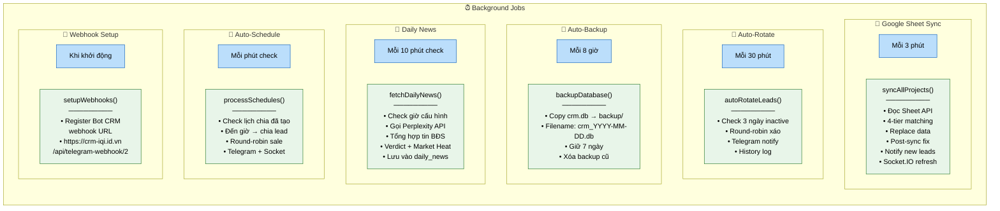

---

## 13. Real-time & Socket.IO

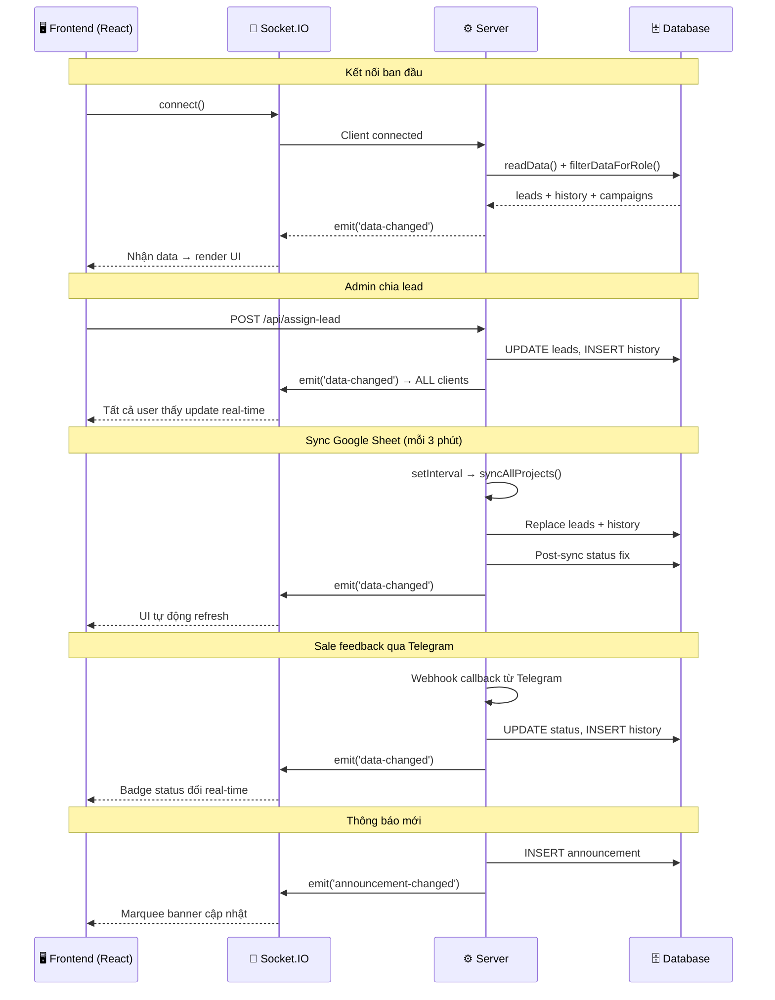

---

## 14. Frontend Pages & Components

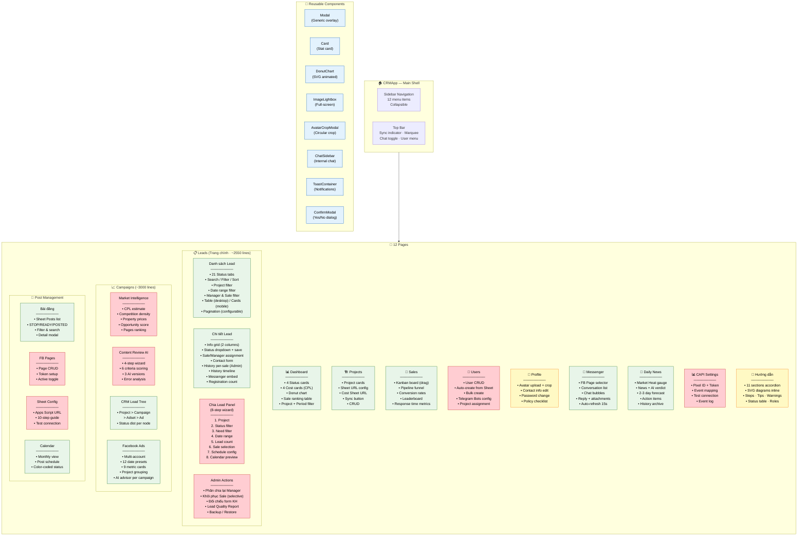

---

## 15. Backup, Restore & An toàn dữ liệu

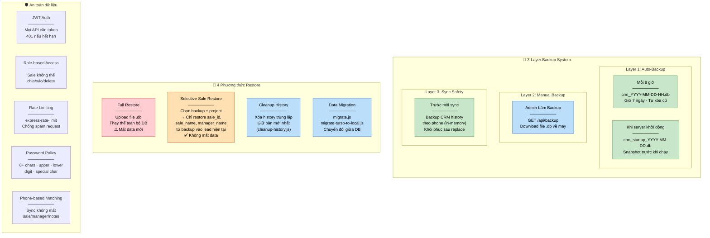

---

## 16. API Endpoints Map

### 🔐 Authentication
| Method | Path | Mô tả | Role |
|--------|------|-------|------|
| POST | `/login` | Đăng nhập, nhận JWT | Public |
| POST | `/change-password` | Đổi mật khẩu | All |
| POST | `/force-change-password` | Đổi mật khẩu bắt buộc | All |

### 📋 Leads
| Method | Path | Mô tả | Role |
|--------|------|-------|------|
| GET | `/api/data` | Lấy tất cả data (leads, history, campaigns) | All |
| POST | `/api/update-status` | Cập nhật trạng thái lead | All |
| POST | `/api/update-sale` | Gán sale cho lead | Admin/Manager |
| POST | `/api/update-manager` | Gán manager cho lead | Admin |
| POST | `/api/update-notes` | Cập nhật ghi chú | All |
| POST | `/api/toggle-hot` | Đánh dấu hot lead | Admin |
| POST | `/api/shuffle-leads` | Xáo lead hàng loạt | Admin |
| POST | `/api/assign-leads` | Chia lead cho sales | Admin/Manager |
| POST | `/api/recall-lead` | Thu hồi lead (xóa history entry) | Admin |
| POST | `/api/cross-reference` | Đối chiếu form khách hàng | Admin |
| POST | `/api/reassign-managers` | Phân chia lại manager | Admin |
| POST | `/api/restore-sales` | Khôi phục sale từ backup | Admin |
| GET | `/api/lead-quality-report` | Báo cáo chất lượng lead | Admin |

### 🔄 Sync & Backup
| Method | Path | Mô tả | Role |
|--------|------|-------|------|
| POST | `/api/sync` | Trigger sync thủ công | Admin |
| GET | `/api/backup` | Download backup DB | Admin |
| POST | `/api/restore` | Upload & restore DB | Admin |
| GET | `/api/backup-files` | Danh sách backup có sẵn | Admin |

### 📅 Schedule
| Method | Path | Mô tả | Role |
|--------|------|-------|------|
| GET | `/api/schedules` | Danh sách lịch chia | Admin |
| POST | `/api/schedules` | Tạo lịch chia mới | Admin |
| DELETE | `/api/schedules/:id` | Xóa lịch chia | Admin |

### 👥 Users
| Method | Path | Mô tả | Role |
|--------|------|-------|------|
| GET | `/api/users` | Danh sách users | Admin |
| POST | `/api/users` | Tạo user mới | Admin |
| PUT | `/api/users/:id` | Cập nhật user | Admin |
| DELETE | `/api/users/:id` | Xóa user | Admin |
| POST | `/api/auto-create-users` | Auto-create từ Sheet | Admin |
| POST | `/api/bulk-create-users` | Bulk create users | Admin |
| PUT | `/api/profile` | Cập nhật profile cá nhân | All |

### 📱 Telegram
| Method | Path | Mô tả | Role |
|--------|------|-------|------|
| GET | `/api/telegram-bots` | Danh sách bots | Admin |
| POST | `/api/telegram-bots` | Tạo bot mới | Admin |
| PUT | `/api/telegram-bots/:id` | Cập nhật bot | Admin |
| DELETE | `/api/telegram-bots/:id` | Xóa bot | Admin |
| POST | `/api/telegram-webhook/:botId` | Webhook handler | Public |
| POST | `/api/setup-telegram-webhook` | Đăng ký webhook | Admin |

### 📘 Facebook
| Method | Path | Mô tả | Role |
|--------|------|-------|------|
| GET | `/api/fb-ads` | Lấy dữ liệu quảng cáo | All |
| GET | `/api/fb-ad-accounts` | Danh sách tài khoản QC | Admin |
| POST | `/api/fb-ad-accounts` | Thêm tài khoản QC | Admin |
| DELETE | `/api/fb-ad-accounts/:id` | Xóa tài khoản QC | Admin |
| GET | `/api/fb-messenger/conversations` | Danh sách hội thoại | All |
| GET | `/api/fb-messenger/messages/:convId` | Tin nhắn hội thoại | All |
| POST | `/api/fb-messenger/send` | Gửi tin nhắn | All |
| GET | `/api/fb-pages` | Danh sách Pages | Admin |
| POST | `/api/fb-pages` | Thêm Page | Admin |
| PUT | `/api/fb-pages/:id` | Cập nhật Page | Admin |
| DELETE | `/api/fb-pages/:id` | Xóa Page | Admin |
| POST | `/api/fb-publish` | Đăng bài lên FB | Admin |
| POST | `/api/capi-send` | Gửi CAPI event | Server |
| POST | `/api/capi-test` | Test CAPI connection | Admin |
| GET | `/api/capi-log` | Xem CAPI event log | Admin |

### 🤖 AI
| Method | Path | Mô tả | Role |
|--------|------|-------|------|
| POST | `/api/content-review` | Phân tích nội dung QC | Admin |
| POST | `/api/campaign-advisor/single` | Tư vấn campaign | Admin |
| POST | `/api/market-intel` | Market Intelligence | Admin |
| GET | `/api/daily-news` | Lấy tin BĐS hôm nay | All |
| GET | `/api/daily-news/history` | Lịch sử tin BĐS | All |
| POST | `/api/daily-news/fetch` | Fetch tin thủ công | Admin |

### 📝 Posts & Content
| Method | Path | Mô tả | Role |
|--------|------|-------|------|
| GET | `/api/sheet-posts` | Danh sách bài đăng | All |
| POST | `/api/sheet-posts/toggle` | Đổi status bài đăng | Admin |
| GET | `/api/sheet-configs` | Cấu hình Sheet posts | Admin |
| POST | `/api/sheet-configs` | Thêm cấu hình | Admin |
| DELETE | `/api/sheet-configs/:id` | Xóa cấu hình | Admin |
| POST | `/api/sheet-configs/test` | Test kết nối Sheet | Admin |

### 💬 Chat & Announcements
| Method | Path | Mô tả | Role |
|--------|------|-------|------|
| GET | `/api/chat/messages/:userId` | Lấy tin nhắn chat | All |
| POST | `/api/chat/send` | Gửi tin nhắn | All |
| POST | `/api/chat/read/:userId` | Đánh dấu đã đọc | All |
| GET | `/api/announcements` | Danh sách thông báo | All |
| POST | `/api/announcements` | Tạo thông báo | Admin |
| DELETE | `/api/announcements/:id` | Xóa thông báo | Admin |

### ⚙️ Settings
| Method | Path | Mô tả | Role |
|--------|------|-------|------|
| GET | `/api/settings` | Lấy cài đặt hệ thống | Admin |
| POST | `/api/settings` | Cập nhật cài đặt | Admin |
| POST | `/api/auto-rotate/toggle` | Bật/tắt auto-rotate | Admin |

---

## 📊 Tổng kết hệ thống

| Thành phần | Công nghệ | Chi tiết |
|------------|----------|---------|
| **Frontend** | React 19 + Vite 7 | 1 file App.jsx ~13,000 lines · 38 components · 12 pages |
| **Backend** | Express 5.1 + Node.js | 1 file index.js ~8,500 lines · 100+ endpoints |
| **Database** | SQLite | 20+ tables · ~500MB · Local file |
| **Real-time** | Socket.IO | 2 events: `data-changed`, `announcement-changed` |
| **Auth** | JWT + bcrypt | 3 roles · Password policy · Rate limiting |
| **Hosting** | VPS Ubuntu | Nginx SSL → Node.js port 4000 |
| **Domain** | crm-iqi.id.vn | Let's Encrypt SSL |
| **Sync** | Google Sheets API v4 | Mỗi 3 phút · 4-tier matching · Post-sync fix |
| **Bot** | Telegram Bot API | Bot CRM (id=2) · Webhook · Inline keyboard |
| **Ads** | Facebook Graph API v21 | Ads insights · Messenger · Pages · CAPI |
| **AI** | OpenAI + Perplexity | Content review · Campaign advisor · Market intel · Daily news |
| **Backup** | 3-layer system | Auto 8h · Startup · Manual · Selective restore |
| **Background** | 6 scheduled jobs | Sync 3m · Rotate 30m · Backup 8h · News 10m · Schedule 1m · Webhook startup |
