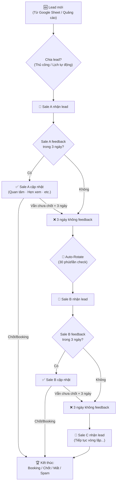
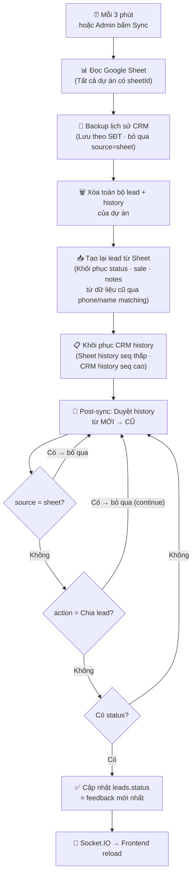
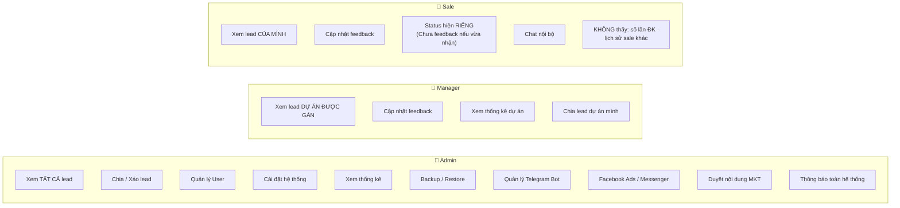

# 📐 Sơ đồ kiến trúc hệ thống CRM IQI

> Mở file này trên GitHub hoặc VS Code (Ctrl+Shift+V) để xem sơ đồ dạng hình ảnh.

---

## 1. Tổng quan kiến trúc hệ thống

```mermaid
flowchart TB
    subgraph EXTERNAL["🌐 Nguồn dữ liệu bên ngoài"]
        GS["📊 Google Sheets<br/>(Dữ liệu lead từ quảng cáo)"]
        TG["📱 Telegram Bot<br/>(Nhận feedback từ sale)"]
        FB_API["📘 Facebook API<br/>(Quảng cáo, Messenger, Fanpage)"]
        AI["🤖 AI / Gemini<br/>(Tư vấn chiến dịch, Duyệt nội dung)"]
    end

    subgraph SERVER["⚙️ Server - Node.js + Express"]
        direction TB
        AUTH["🔐 Xác thực<br/>Login / JWT / Phân quyền<br/>(Admin · Manager · Sale)"]

        subgraph SYNC["🔄 Đồng bộ tự động (3 phút/lần)"]
            SYNC_SHEET["syncAllProjects<br/>Đọc Sheet → Xóa & tạo lại lead<br/>→ Khôi phục CRM history"]
            POST_SYNC["Post-sync<br/>Ghi lại status từ lịch sử CRM<br/>(bỏ qua sheet · tìm feedback mới nhất)"]
            SYNC_SHEET --> POST_SYNC
        end

        subgraph LEAD_MGMT["📋 Quản lý Lead"]
            CHIA["Chia lead (thủ công)<br/>Admin gán lead → Sale"]
            SHUFFLE["Xáo lead (thủ công)<br/>Admin xáo lại hàng loạt"]
            HISTORY["Lịch sử liên hệ<br/>Sale/Admin cập nhật feedback"]
            NOTES["Ghi chú lead<br/>Hot lead / Manager"]
        end

        subgraph AUTO["🤖 Tự động hóa"]
            AUTO_ROTATE["Auto-Rotate (30 phút/lần)<br/>3 ngày không feedback<br/>→ Xáo qua sale khác"]
            SCHEDULE["Lịch chia tự động<br/>Chia lead theo lịch<br/>(thời gian + sale + dự án)"]
        end

        subgraph DATA_VIEW["📊 Hiển thị dữ liệu"]
            READ_DATA["readData<br/>Đọc tất cả lead + history"]
            FILTER_ROLE["filterDataForRole<br/>Sale: chỉ thấy lead của mình<br/>Manager: thấy dự án được gán<br/>Admin: thấy tất cả"]
            FILTER_SALE["filterLeadsForSale<br/>Hiện status PER-SALE<br/>(Sale thấy status riêng)"]
        end

        subgraph ANALYTICS["📈 Báo cáo & Phân tích"]
            SALE_ANALYTICS["Thống kê Sale<br/>(Số lead · tỉ lệ chốt)"]
            LEAD_REPORT["Báo cáo Lead<br/>(Theo dự án · trạng thái)"]
            FB_ADS["Facebook Ads Insights<br/>(Chi phí · chiến dịch)"]
        end

        subgraph COMMS["💬 Giao tiếp"]
            CHAT["Chat nội bộ<br/>(Giữa các user)"]
            MESSENGER["FB Messenger<br/>(Trả lời inbox khách)"]
            ANNOUNCE["Thông báo<br/>(Admin gửi toàn bộ)"]
        end

        subgraph TOOLS["🛠️ Công cụ"]
            BACKUP["Backup tự động (8h/lần)<br/>& Khôi phục dữ liệu"]
            CAPI["Facebook CAPI<br/>Gửi event khi đổi trạng thái"]
            CONTENT["Duyệt nội dung MKT<br/>(AI kiểm tra bài đăng)"]
            NEWS["Tin tức BĐS tự động<br/>(Fetch hàng ngày)"]
            SHEET_POST["Quản lý bài đăng<br/>(Từ Google Sheet)"]
        end

        SOCKET["🔌 Socket.IO<br/>Real-time cập nhật UI"]
    end

    subgraph DB["🗄️ SQLite Database"]
        T_LEADS["leads<br/>(id · name · phone · status ·<br/>sale_name · manager_name)"]
        T_HISTORY["lead_history<br/>(lead_id · sale_name · action ·<br/>status · feedback · seq · source)"]
        T_USERS["users<br/>(id · username · role ·<br/>displayName · projectIds)"]
        T_PROJECTS["projects<br/>(id · name · sheetId ·<br/>is_legacy)"]
        T_SCHEDULES["lead_schedules<br/>(project · sales · times ·<br/>status_filter)"]
        T_OTHER["Các bảng khác:<br/>campaigns · settings ·<br/>telegram_bots · fb_pages ·<br/>capi_log · announcements"]
    end

    subgraph FRONTEND["🖥️ Frontend - React + Vite"]
        UI_DASH["Dashboard<br/>Tổng quan lead theo trạng thái"]
        UI_LEADS["Danh sách Lead<br/>Tìm kiếm · lọc · phân trang"]
        UI_DETAIL["Chi tiết Lead<br/>Lịch sử per-sale (Admin)<br/>Lịch sử cá nhân (Sale)"]
        UI_ASSIGN["Chia / Xáo Lead<br/>Drag & drop · bulk assign"]
        UI_SETTINGS["Cài đặt<br/>User · Bot · Sheet · CAPI ·<br/>Lịch chia · Auto-rotate"]
        UI_ANALYTICS["Thống kê & Báo cáo<br/>Biểu đồ · xuất Excel"]
        UI_SOCIAL["MXH & Quảng cáo<br/>FB Ads · Fanpage · Messenger"]
    end

    %% External connections
    GS -->|"3 phút/lần"| SYNC_SHEET
    TG -->|"Webhook"| HISTORY
    FB_API --> FB_ADS
    FB_API --> MESSENGER
    FB_API --> SHEET_POST
    AI --> CONTENT
    AI --> FB_ADS

    %% Server internal flows
    AUTH --> LEAD_MGMT
    AUTH --> AUTO
    AUTH --> ANALYTICS

    POST_SYNC --> T_LEADS
    CHIA --> T_HISTORY
    CHIA --> T_LEADS
    SHUFFLE --> T_LEADS
    SHUFFLE --> T_HISTORY
    HISTORY --> T_HISTORY
    HISTORY --> T_LEADS
    HISTORY -->|"Nếu status thay đổi"| CAPI

    AUTO_ROTATE --> T_LEADS
    AUTO_ROTATE --> T_HISTORY
    SCHEDULE --> T_LEADS
    SCHEDULE --> T_HISTORY

    READ_DATA --> T_LEADS
    READ_DATA --> T_HISTORY
    READ_DATA --> FILTER_ROLE
    FILTER_ROLE --> FILTER_SALE

    BACKUP --> DB

    %% Socket real-time
    SYNC_SHEET --> SOCKET
    CHIA --> SOCKET
    SHUFFLE --> SOCKET
    AUTO_ROTATE --> SOCKET
    HISTORY --> SOCKET

    %% Frontend connections
    SOCKET -->|"Real-time"| FRONTEND
    FILTER_SALE --> UI_LEADS
    FILTER_SALE --> UI_DETAIL
    SALE_ANALYTICS --> UI_ANALYTICS
    FB_ADS --> UI_SOCIAL
```

---

## 2. Vòng đời Lead & Hiển thị Status

---

## 3. Luồng đồng bộ Google Sheet & Post-sync

---

## 4. Phân quyền theo vai trò

---

## 5. Danh sách tính năng chi tiết

### 📋 Quản lý Lead
| Tính năng | Mô tả | Trigger | Ai dùng |
|-----------|--------|---------|---------|
| Chia lead thủ công | Gán lead cho sale cụ thể | Admin bấm nút | Admin/Manager |
| Xáo lead thủ công | Shuffle lead hàng loạt | Admin bấm nút | Admin |
| Auto-Rotate | 3 ngày không feedback → xáo | 30 phút/lần check | Tự động |
| Lịch chia tự động | Chia lead theo lịch | Đúng giờ đã đặt | Tự động |
| Cập nhật feedback | Sale ghi trạng thái lead | Sale bấm nút / Telegram | Sale/Admin |
| Ghi chú | Thêm note cho lead | Bấm nút | Sale/Admin |
| Hot lead | Đánh dấu lead nóng | Bấm nút | Admin |
| Gán Manager | Phân công quản lý cho lead | Admin chọn | Admin |

### 🔄 Đồng bộ & Dữ liệu
| Tính năng | Mô tả | Trigger | Tần suất |
|-----------|--------|---------|----------|
| Google Sheet sync | Đọc lead từ Sheet về DB | Tự động | 3 phút |
| Post-sync status fix | Sửa status theo CRM history | Sau mỗi sync | 3 phút |
| Backup | Sao lưu database | Tự động + thủ công | 8 giờ |
| Restore | Khôi phục từ backup | Admin bấm nút | Thủ công |

### 📱 Tích hợp bên ngoài
| Tính năng | Mô tả | Kết nối |
|-----------|--------|---------|
| Telegram Bot | Sale feedback qua Telegram | Webhook |
| Facebook CAPI | Gửi event khi đổi trạng thái | API |
| Facebook Ads | Xem chi phí chiến dịch | API |
| FB Messenger | Đọc/trả lời inbox | API |
| FB Fanpage | Quản lý bài đăng | API |
| AI Content Review | Kiểm tra nội dung MKT | Gemini API |
| Campaign Advisor | Tư vấn chiến dịch QC | Gemini API |

### 💬 Giao tiếp
| Tính năng | Mô tả | Ai dùng |
|-----------|--------|---------|
| Chat nội bộ | Nhắn tin giữa user | Tất cả |
| Thông báo | Admin gửi thông báo | Admin |
| Tin tức BĐS | Tự động fetch tin tức | Tự động |
